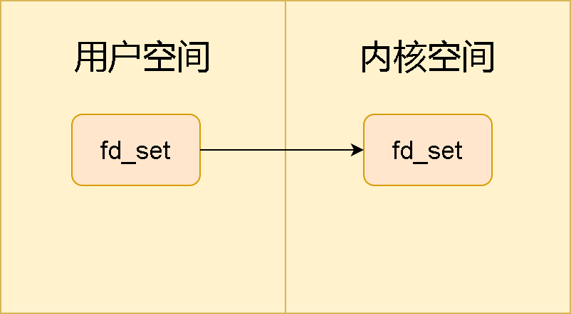

虽然目前fancy的技术一堆，面试里也经常侃 select poll epoll NIO，但是很有意思的是，大家对NIO解决了什么问题如数家珍，但对为什么会提出IO模型，IO模型主要想解决什么一脸懵逼。咱今天先从这个出发，来看看IO模型主要解决了啥。

## IO模型
IO模型，字面理解就是输入输出模型嘛。但咱目前的面试中，它主要指代的是网络的IO模型。

当然范围可以再缩小一点，一般面试问的是linux下的网络IO模型。
对于Linux的网络请求，一般都是基于socket。相信作为程序员的大家对socket这个词不会太陌生。socket，又称为套接字。
在linux这一切皆文件的系统设计思想上，每一次网络通信建立，也可以看作打开了一个socket文件，每一次通信的结束，也变成了关闭一个socket文件。

既然是socket文件，当然也有对应的文件描述符。对于每个进程，都存在一张socket描述符表，存在它对应的用户空间，通过socket的文件描述符，就可以找到套接字的数据结构，但值得注意的是，套接字对应的数据结构都存在的是内核空间。
这个数据结构也称为socket的缓冲区。对于write函数，就是往这个缓冲区写数据，对于read，就是往这个缓冲区读数据了。

好了，举个例子，目前这个进程有100个网络连接，那也就是说，它有100个socket文件。
如果此时程序只有一个线程在跑，它应该怎么处理呢？

我来写个什么语言都不是的伪代码：

```c
while(true){
    for(fd in socketFdList){
        if(fd has data){
            read(fd,buffer);
            print(buffer);
        }
    }
}
```

逻辑很清晰，线程一个死循环跑死，对于我们所有的socket文件描述符表，挨个读数据，读到缓存区buffer中，最后把buffer 输出出来。

好，那这种方法有什么问题？
一个字，慢！
由于socket文件的数据存储集中在内核空间，所以作为用户空间的线程，在每进行一次循环，都要做一次搬运，把内核空间的数据搬过来，在上文例子中，一共有100个网络连接文件。对于每次判断有无数据，需要用户态内核态切换一次，读取数据，又需要一次。也就是说，它需要来回切内核空间和用户空间200次。熟悉操作系统的小伙伴不用我说也知道这部分代价有多大了吧。


## Select

### 写在前面
让大家写个最简单的IO模型，相信大家肯定会想到下面的逻辑：
```c
while(true){
    for(fd in socketFdList){
        if(fd has data){
            read(fd,buffer);
            print(buffer);
        }
    }
}
```
简单来说，一个死循环，不断判断我们监听的所有文件是否有新数据，有的话读入，没有的话判断下一个文件是否有数据，直到判断完所有数据。

这个方法缺点也很明显，就是慢！
由于socket文件的数据存储集中在内核空间，所以作为用户空间的线程，在每进行一次循环，都要做一次搬运，把内核空间的数据搬过来，在上文例子中，一共有100个网络连接文件。对于每次判断有无数据，需要用户态内核态切换一次，读取数据，又需要一次。也就是说，它需要来回切内核空间和用户空间200次。这种切换损耗太大了。

既然代价这么大，那肯定有解决方法。

今天就来介绍我们的主角：select

### select
select函数是一个监视函数，它用来监视一个或多个文件描述符是否变为ready状态。


```c
int select(int nfds, fd_set *readfds, fd_set *writefds,
        fd_set *exceptfds, struct timeval *timeout);
```
readfds： 读文件描述符集合
writefds： 写文件描述符集合
exceptfds： 异常文件描述符集合
timeout:  超时时间，不填就是默认超时时间

这个fd_set数据结构就是操作系统中的位图。
什么是位图呢？举个例子大家就明白了，我们有10个文件描述符，那位图初始化就是0000000000。
如果我们需要监听的是第5个和第6个文件描述符对应的socket文件，其他文件我不care，那位图就变成了
0000110000。

对于select函数，它对应的位图大小只有1024位。

select函数具体做了啥事呢？
首先，用户在操作系统的用户空间存了一份他关心的文件描述符集合位图

其次，由于在用户空间，那要给操作系统看的话，必须把这份传给内核空间

内核根据描述符集合，一个个看关心的文件是否有新数据。由于select文件是阻塞的，所以必须等函数运行完成后，才会执行select之后的操作。

当select执行完成后，会把有新值的socket对应的文件描述符置的bitmap(也就是fd_set)置为1，没新值的还是为0，用户知道了哪个socket文件有新值了，之后就把对应的数据读入就行了。

所以，利用select函数，读取IO数据的流程如下：
1. 调用select 函数得到对应的fd_set的返回值，知道哪写文件描述符产生了可读事件。切换次数为1。
2. 对于这100个文件，再分别调用100次读取，相当于用户态和内核态切换了100次。

根据这个推理，整体的用户态内核态切换次数就从200变为了101次。

确实这个方式能省下不少内核态和用户态的切换次数。但也有缺陷。

### 缺陷1：bitmap有长度限制
我们知道，select函数，输入参数从位图（fd_set）默认只有1024位，这也代表，该函数只能监控1024个文件描述符。 

### 缺陷2：执行select函数，有一次用户态内核态切换开销
这个很好理解，就是fd_set需要从用户态拷贝到内核态，然后再把内核态的数据拷贝回来

### 缺陷3：时间复杂度较高
举个例子，目前我们虽然监控了1024个文件描述符，但调用了select函数的情况下，返回1，即只有一个文件有新数据。

按之前我们处理的逻辑，还不是得把这1024位遍历一下，看看哪个是1，从而找到对应的那个有新数据的文件。

如果函数直接告诉我，哪几个文件被动过了，就省去了这个O(n)复杂度，提高了效率。

## poll
### 写在前面
select是理解NIO的第一个高频考点，不熟的大家伙可以看这篇文章。
今天紧接着select，来讲讲poll。

### poll

poll的具体功能和select类似。它也是一个监控函数，用来看监听的文件描述符对应的文件有没有新的数据产生。
来看看poll的函数原型。
```c
int poll(struct pollfd fd[], nfds_t nfds, int timeout);
```

fd: 一种pollfd结构体对应的文件描述符数组。这个结构体长这样：

```c
struct pollfd {
    int fd;
    short events;
    short revents;
};
```
fd：感兴趣文件对应的文件描述符。

events：对这个文件描述符感兴趣的事件，比如读对应常量POLLIN，写对应常量POLLOUT。如果读写都在意，可以设置event为 POLLIN & POLLOUT。

revents：当 poll 返回时，在该文件描述符上已经发生了哪些事情

nfds： 即fd数组长度。

timeout：等待时间。如果为-1代表无限期等待。

我们来看看poll函数具体干了什么事


由于在用户空间，那要给操作系统看的话，必须把这份传给内核空间


对于之前select情况，当select执行完成后，会把有新值的socket对应的文件描述符置的bitmap(也就是fd_set)置为1，没新值的还是为0。

对于poll就不一样了哈。
它就不是直接在原始结构中置位的，而是将结果存在revents中。

所以，利用poll函数，读取IO数据的流程如下：
1. 对于需要监听的fd数组，调用poll 函数。
2. 遍历所有fd数组元素，判断调用后fd数组的每个元素revent是否有值得注意事件（如读事件就是判断fd[i].revents & POLLIN是否为1），如果有，则读取数据

我们来看看相对select，poll有哪些优势
1. select监听文件上限是1024，poll通过结构体数组，解决了这个上限问题。

所以，select其他两个缺点，poll仍然存在，即：

### 缺陷：执行poll函数，有一次用户态内核态切换开销
这个很好理解，就是fd需要从用户态拷贝到内核态，然后再把内核态的数据拷贝回来

### 缺陷：时间复杂度较高
按之前我们处理的逻辑，需要遍历fd数组，从而找到对应的那个有新数据的文件。

如果函数直接告诉我，哪几个文件被动过了，就省去了这个O(n)复杂度，提高了效率。

## epoll
### 写在前面
今天来讲讲epoll，这也是NIO中作为最高频率考点的函数。
在理解epoll之前，大家得先读读select 和poll。
贴文章链接。

### epoll
通过前面对NIO的select 和poll的介绍，我们可以知道，这两个方法有一些固有缺陷，而epoll的引入，就是为了解决这部分的问题。
epoll触发方式分为水平触发和边缘触发，由于redis采用的是水平触发模式，所以本篇只讨论水平触发。

epoll的设计思想非常朴素，使用select和poll的想法是一下子跟操作系统说，我们对x号，Y号，z号等文件感兴趣，如果这些文件出现改动，请把这些文件对应的标志位改改，我遍历这个感兴趣列表，把有变化的文件找出来，然后读取。
操作系统干的活少，个人干的活多。

epoll就比较简单粗暴了，用这种方式，类似于直接跟操作系统说，我这有个感兴趣列表，如果这些文件出现改动，请帮我把有改动文件直接放一块递给我。


epoll的具体流程跟select和poll就不大一样了，我们来看看具体流程。
1. 首先需要调用函数epoll_create()，生成一块池子，这块空间我们用epfd指代。
   
   值得注意的是，这部分空间采用共享内存。对这部分数据进行操作，不需要把数据在用户态和内核态移来移去。这个池子，就用来监控和管理感兴趣的文件描述符。
   （补充说一下，epfd这个池子使用红黑树结构，存储管理文件描述符）
2. 这一步具体过程就是调用epoll_ctl函数，增加需要监听的文件描述符条目
   
这个函数epoll_ctl的函数原型长这样。

```c
int epoll_ctl(int epfd, int op, int fd,
                 struct epoll_event *event);
```
这个函数的具体作用就是往epfd池子中增删改感兴趣的文件。

来看看各个参数具体意义：
- epfd参数：就指代前文epoll_create申请的空间
- op参数：代表该项操作是增/删/改。
- fd：感兴趣的文件对应的文件描述符个数
- event：告诉内核哪些文件描述符需要监听哪些事件。

event 的定义长这样：
```c
struct epoll_event
{
    uint32_t events;
    epoll_data_t data;
}
```
其中events就是epoll监听的事件类型，data主要包含了文件描述符。

换句话说，event包含了我们对某某文件发生某某事件类型有兴趣的所有信息。

epoll_data_t结构体长这样：
```c
typedef union epoll_data {
    void *ptr;
    int fd;
    __uint32_t u32;
    __uint64_t u64;
} epoll_data_t;
```

1. 我们需要调用epoll_wait函数，来等待感兴趣文件描述符上的I / O事件。

```c
int epoll_wait（int epfd，struct epoll_event * events， 
                int maxevents，int timeout）;
```

当有新数据来到感兴趣的文件中，比如这样：（绿色代表有数据）
   

它就会进行重排，把有数据的fd放在前面，变成这样：
   

并且epoll_wait 函数返回有数据的文件描述符个数。

在本例中，epoll_wait返回2。
所以我们只需要根据epoll_wait的返回值x，对events对应的前x个文件描述符进行数据读取就ok了。


我们来看看相对poll，epoll有哪些优势
1. 执行poll函数，有一次用户态内核态切换开销。而epoll函数通过共享内存的方式，解决了这个问题，减少了这次开销

2. 按poll的处理逻辑，需要遍历fd数组，从而找到对应的那个有新数据的文件。而epoll通过重排的方式，减少了时间复杂度。

参考
1. https://www.bilibili.com/video/BV1qJ411w7du
2. https://zhuanlan.zhihu.com/p/165287735
3. https://mp.weixin.qq.com/s/OmRdUgO1guMX76EdZn11UQ