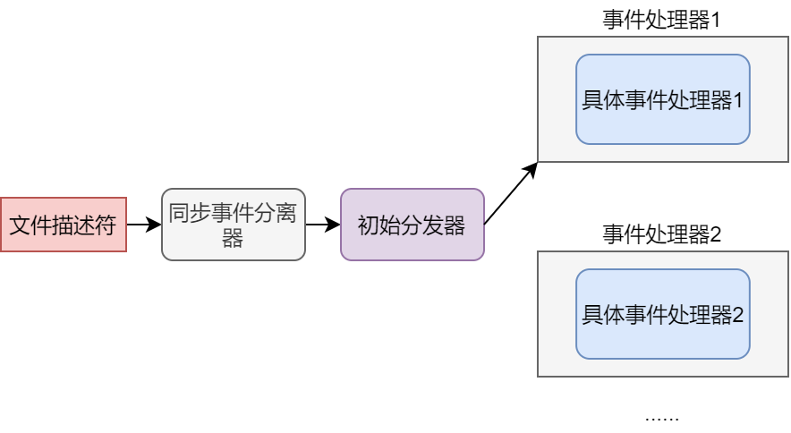

## Reactor
其实不仅在Redis的面试中，在其他系统设计面试中，Reactor也是一个绕不去的槛。
今天小牛也希望，在这短短几分钟内，给大家把这个知识点讲明白。

一般处理web请求时，有两种设计方式。我们来分别看一下：

### thread-based architecture
翻译一下，这个中文就叫基于线程的架构。这种设计思想非常简单，每有一个新的请求进来，就New一个新线程，处理这个请求。

这个设计优点就在简单直接，缺点也很明显，线程多，占用内存也多，操作系统执行线程切换也需要一定开销。

### event-driven architecture
翻译一下，这个中文就叫事件驱动的架构。

这里的架构，每个线程就不是负责处理一个单独的请求了，而是作为特定事件的回调函数进行处理。

这种架构也是基于生产者消费者模型，生产者负责生产特定事件，消费者负责从特定事件池中获取，并且处理消费该事件。

大家有个大概理解了吧，但是是不是还是有点模糊，没关系，看完Reactor这个设计模式就清楚了。

### Reactor
Reactor是event-driven architecture的杰出代表。
该模型由 *Douglas C. Schmidt* 在文章*Reactor
An Object Behavioral Pattern for
Demultiplexing and Dispatching Handles for Synchronous Events*中提出，原文我贴在参考目录了，大家有兴趣可以看一下。

我们来看看具体模式的结构：

在这个模型中有如下几个角色：
1. 文件描述符。这个在我们前期文章NIO中也反复提过，文件描述符是事件发源地。
2. 同步事件分离器。通俗点说，就是我们之前讲的select poll epoll。
3. 事件处理器。定义一些回调方法。
4. 具体事件处理器。对事件处理器的具体实现
5. 初始分发器。负责注册，删除和转发某个事件给事件处理器。

当然，具体过程也非常清晰啦：
同步事件分离器监听文件描述符，当某个文件描述符有事件发生，就把这个事件扔给初始分发器，初始分发器交给特定事件处理器进行完成就ok了。

### 参考文献
1. http://www.dre.vanderbilt.edu/~schmidt/PDF/reactor-siemens.pdf
2. https://dzone.com/articles/understanding-reactor-pattern-thread-based-and-eve#:~:text=Event-driven%20approach%20can%20separate%20threads%20from%20connections%2C%20which,event%2C%20only%20knows%20that%20the%20event%20has%20occurred.

3. https://www.jianshu.com/p/eef7ebe28673