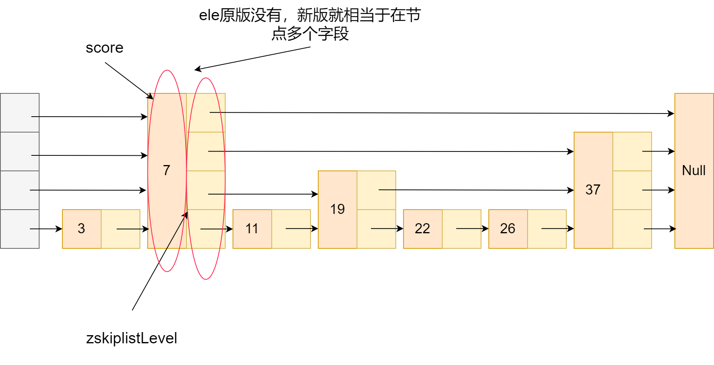

## Redis跳表实现
我们来看看Redis的zset。

zset是什么？首先顾名思义，zset包含单词set，因此它肯定是满足集合的性质，即在zset中的元素不重复。

当然要只用集合性质，set就够了。zset还有个特质就是它是带权重的集合。

比如对于热搜这个情景下，我们可以往set中存热搜的标题，保证热搜的标题在集合中不重复，然后再搞个哈希表，键存储热搜标题，值存储当前热度。

要是我们首页只能显示10条热搜，我们得挨个把这个哈希表读下来，然后排序，获得热搜的top10。

复杂度略高，对于时间复杂度有没有简化？当然可以，只要我们存储这个热搜标题，按热度存放就行了嘛，到时候顺序读取top10就完事。

嘿，那你可跟redis想一块去了，zset就这么干的。

底层实现：跳表**（贴跳表文章链接）**

在原始跳表的基础上，redis做了点改进，之前咱跳表是按值大小，现在变成权值大小，来看看它跳表节点定义：

```c
typedef struct zskiplistNode {
    sds ele;//元素，在热词情景中，就变成了一段文字
    
    double score;//权重值，热词情景下就是热度

    struct zskiplistNode *backward;//指向后面的指针

    struct zskiplistLevel {
        struct zskiplistNode *forward;
        unsigned long span;
    } level[];
    //节点的level数组，就是咱跳表上一讲每个节点背后那一筐
} zskiplistNode;
```
来结合上次的跳表的图再理解一下。



非常好理解对不对。节点定义理清楚了，来看看redis跳表的定义：
```c
typedef struct zskiplist {
    struct zskiplistNode *header, *tail;
    unsigned long length;
    int level;
} zskiplist;
```
属性也很简单，就是跳表头节点，尾节点，长度和层数嘛。

来看看zset支持的操作：
1. zadd: 增加元素，如zadd mZySet 100 niu，添加元素niu，score为100
2. zcard: 查询zset元素个数。
3. zrank: 获取元素在zset的位置，如zrank mZySet niu，返回niu字段在zset的位置
4. zcount：获取指定score之间存在的成员个数，如zcount 9 99，获取在9到99元素个数，瞬间感觉是不是zset可以用来做成绩录入系统了对不对。
5. zrangebyscore：获取指定score之间存在的成员。如zrangebyscore myZset 9 99获取在9到99元素。 
6. zrem：删除元素，如zrem mZySet niu，删除元素niu。
7. zscore: 获取指定值分数，如zscore mZySet niu

其他不常见api可以去redis官网获取哈。

参考：
1. https://blog.csdn.net/helloworld_ptt/article/details/105801262
2. Redis设计与实现
3. Redis源码剖析与实战