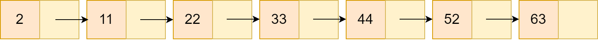
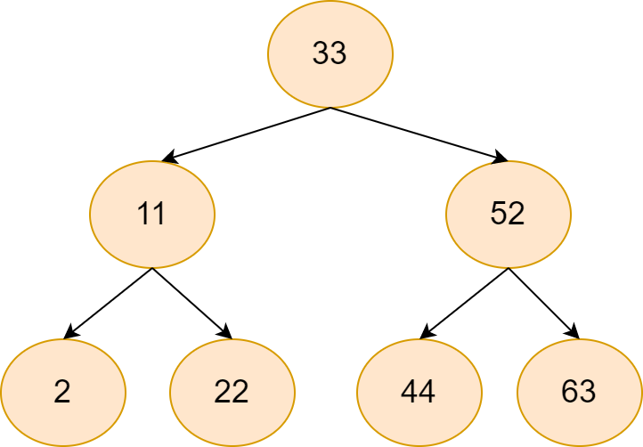
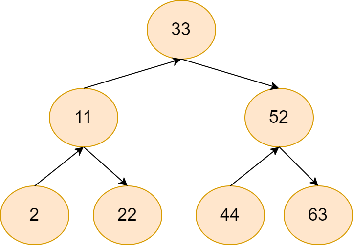
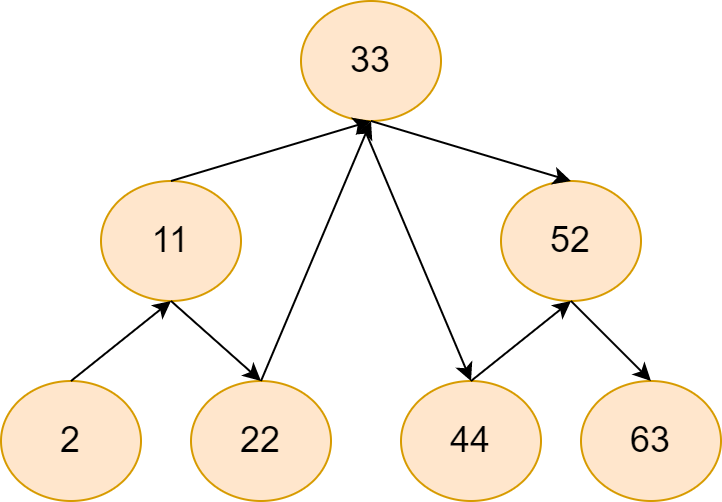
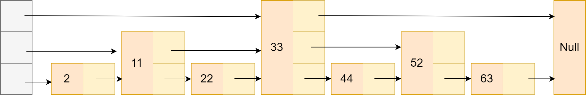
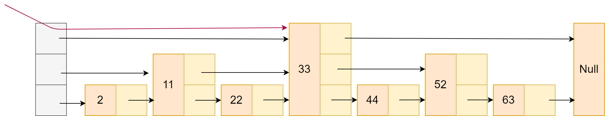
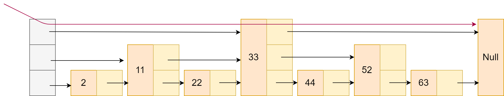
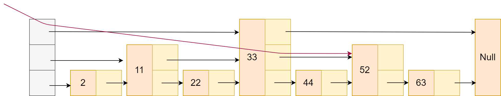
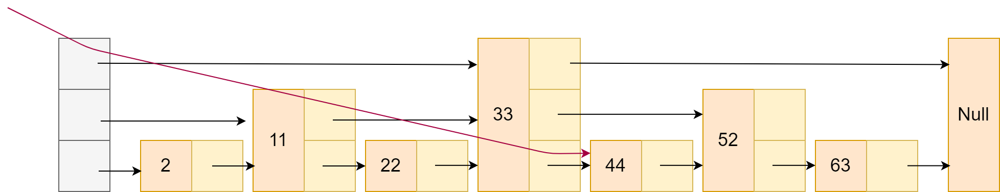
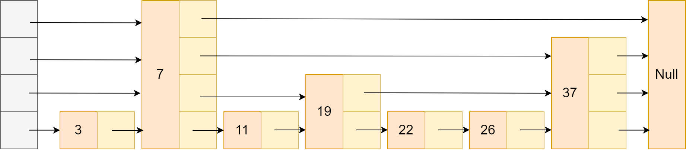

## 简述redis的跳表
跳表这一数据结构，已经成为了Redis面试的高频考点。前两年没这么卷的时候，可能大家从开始学习，到拿到大厂offer这一过程，都可能没听说过跳表这一数据结构。

那什么是跳表呢？它是用来干啥的？
AVL树红黑树知道吧，对，跳表跟他干的事情差不多。我举个例子大家就明白了。
假设目前有一个有序数列：

[2, 11，22, 33, 44, 52, 63]

我们想基于单链表的思想，设计一个数据结构，实现查找时间复杂度为O(logn)。
单链表的话，它的结构长这个样子。

当然这个结构，查找时间复杂度妥妥的O(n)，那咋改呢？

那换个问法：一般做算法题，手撕代码面试的时候，当咱写了个时间复杂度为O(n)的解法，面试官摇摇头，问你有没有更好的方法，你会怎么做？

常见复杂度O(nlogn) O(n) O(logn) O(1)，要优化，一步步来的话，只能上O(logn)了，那复杂度logn最常见的算法是哪个？当然是二分！

思路对了，那对着链表，咋把二分思想融合进去呢？

要不单链表指针这边动动刀子？让指针除了指向后面元素，还能越过几个节点，指向更后面元素？
类似二叉查找树？先来看看这个数组对应的二叉查找树长什么样。

当然，由于我们的结构是单链表，所以只能有由小值，指向大值，这个二叉树得改改。

好像有点意思在里面了，再把原先单链表的性质加上。

走线有点凌乱，按单链表的布局显示方式改改：（值得注意的是，我们需要新建一个数组项，每个数组项存储一个指针，指向刚刚二叉搜索树每一层最左侧的节点）

（咋感觉越看越像B+树了（雾））

来看个查找逻辑吧：
1. 当查找到的结点保存的数，比要查找的数小时，跳表就会继续访问该层上的下一个结点。

2. 当不满足时，跳表就会用到当前查找到的结点的指针数组的下一层指针，然后沿着下一层指针继续查找。

对于这种数据结构，我们需要从上往下依次查询三个链表，比如我们想查大于35的数字。

1. 首先按左侧数组第一个找，发现中间节点是33，比较一下比35小。

2. 发现33比35小，跳下一个节点。

3. 发现该节点是Null，跳33的下一层节点。

4. 发现52比35大，再跳下一层节点。

5. 发现44比35大，跳下一层节点，但由于这是最后一层节点，即44是第一个比33大的数，满足最终条件，就找到了第一个比35大的数字。

我们知道，二叉平衡树，如果设计插入操作，会特别特别麻烦。对于由二叉平衡树思想改的跳表也是如此，对于我们这边的情况，每增加，或者减少一个新节点，每个节点的高度都需要变化。。那有没有高人改进呢？

既然把二叉平衡树改成这四不像了，为啥再不改改，能不能让他不平衡的同时，还能保证查找效率？

说实话，还真可以，来看看这种跳表。

虽然这个跳表跟咱刚刚讲的跳表比起来，奇形怪状的，但按刚刚的查找思路，还是能做比较好的查询工作的。

而且既然表都长这么奇形怪状了，那添加或者删新元素，其他节点高度不变问题也不大了。

而且惊人的是，如果我们对新插入节点的高度进行随机产生(每次随机大于p，接着往上加高度，小于p停下来)，然后别的节点高度保持不变，查找效率还是为O(logn)，不会出现像二叉查找树那种直接退化成O(logn)的情况。

有兴趣想看推导的同学点个赞，点赞破100，咱写波推导。（目前面试还没卷到要证明跳表时间复杂度的程度，所以不知道咋推没问题）

参考：
1. https://blog.csdn.net/helloworld_ptt/article/details/105801262
2. Redis设计与实现
3. Redis源码剖析与实战