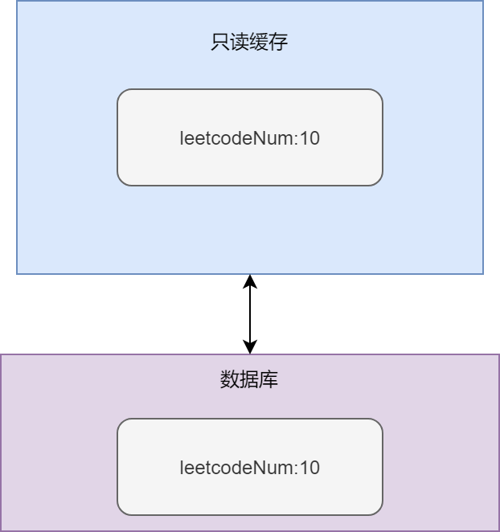
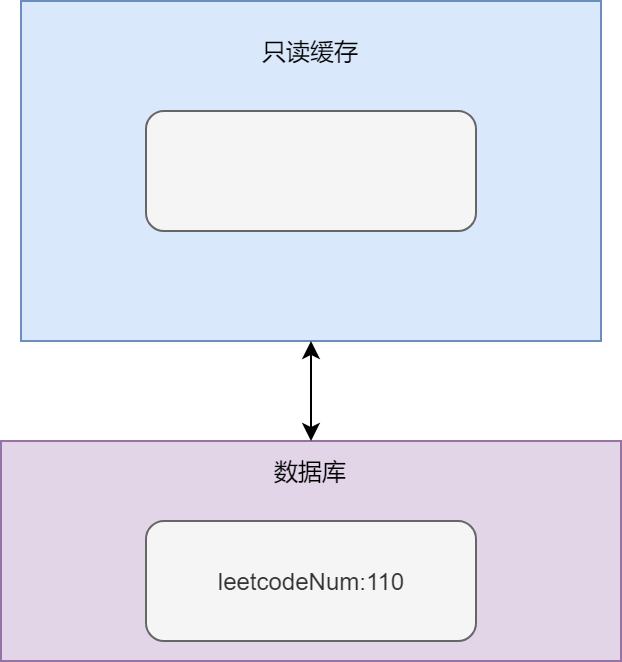
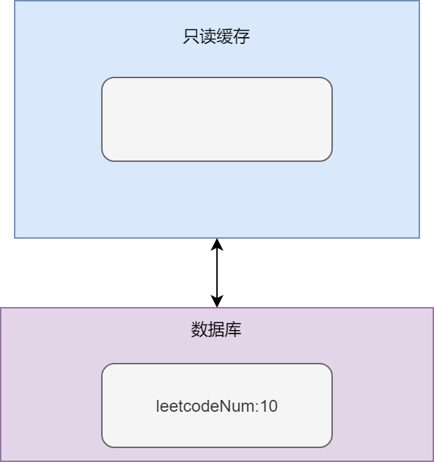
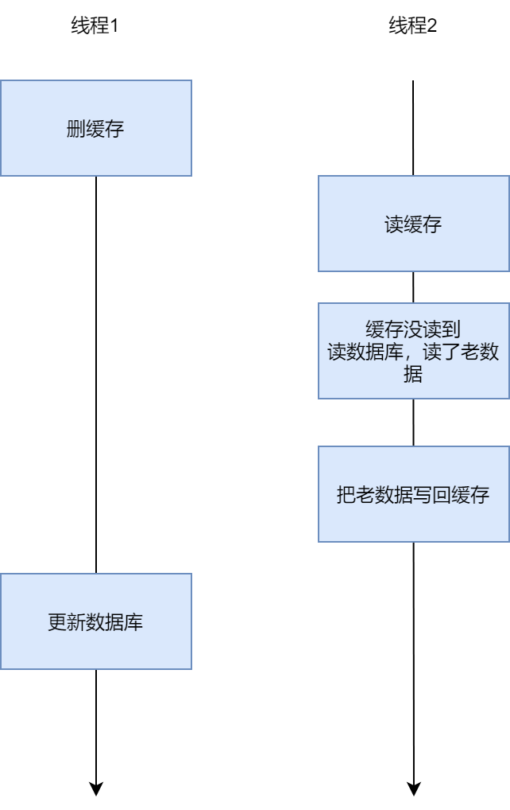
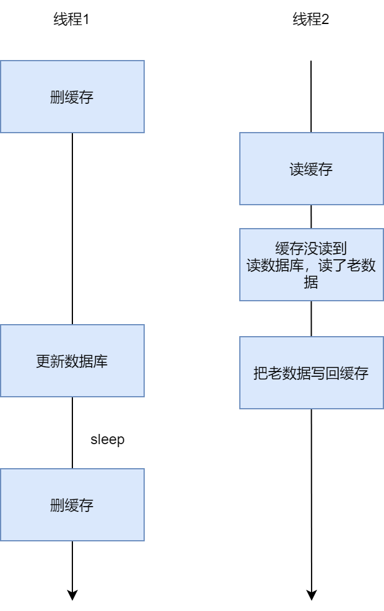
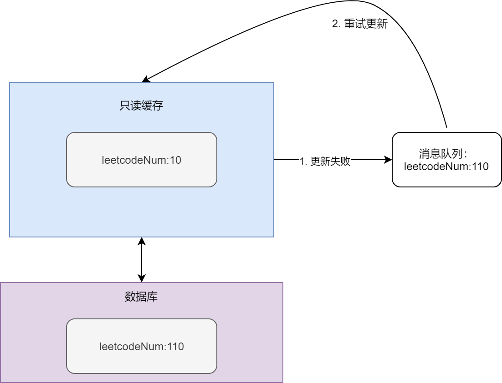

## 缓存一致性
既然Redis在企业中经常是作为缓存层使用的，那缓存一致性就成为了绕不开的一个坎。

缓存不一致，通俗点来说，就是缓存层存的数据不是最新数据，而是老数据的情况。

一般而言，企业对于缓存处理有两种策略：
1. Cache Aside模式。新数据来了，更新数据库/删除缓存（这两步顺序可以颠倒）。
2. Read/Write Through模式。 新数据来了，更新数据库/更新缓存（这两步顺序可以颠倒）。

明眼人也看出来了，无论是cache aside模式还是Read/Write Through模式，都在特定情况下存在问题。
下面以cache aside，咱来举个例子：

如果我们当前用redis缓存了小牛刷了多少leetcode:

如果小牛当天又刷了100题，咱们Cache Aside系统设计有两种策略。

1. 先删除缓存，再更新数据库。

一般来说，这个方式能运行的好好的。

但如果当天运气不好，缓存删除成功了，数据库更新失败，此时由于缓存失效，会访问数据库，但数据库里是旧值，那就出问题了。如果此时有一个用户执行读操作，就会将数据库中的旧值读入缓存中，导致缓存最终存储的是旧数据。

2. 先更新数据库，再删除缓存。

一般当然也不会有问题，但有可能出现这么个情况，就是数据库更新成功，缓存删除失败。这样缓存最后存储的也是老数据。

## 如何解决缓存一致性问题、
Redis缓存一致性问题，也根据Cache Aside模式或Read/Write Through模式有不同的处理策略。

先来看看Cache Aside模式，对于它来说有哪些处理方式：

1. 设置过期时间。对于所有数据，都设置一个过期时间，这样一来，那肯定能保证数据库的最终一致性。

2. 延迟双删。这个方法名字看起来高大上，实际上，非常简单，就是字面意思，删两遍缓存，即：
- 先删除缓存
- 再把新数据写入数据库
- 休眠一定时间
- 再删数据库

    为啥要这么干呢？其实是为了解决并发情况下的这种情况：
    

    在这种情况下，线程1好好的，把缓存删了，兴高采烈的执行完数据库的更新，以为万事大吉了，结果，被线程2玩了一手，缓存还是老数据。

    如果是利用了延迟双删，即在写往数据库写新数据的情况下，休眠一个时间，这个时间当然够线程2执行这么一票操作，再删除，那就能保证这块缓存不会出现老数据。

    
    为了解决缓存一致性问题，即让缓存最终存的数据，要么是最新的，要么就直接设置为过期，别存，有两种策略，分别为设置过期时间方法，利用消息队列的重试方法和延迟双删方法。

讲完了Cache Aside模式，咱们来看看Read/Write Through模式。
1. 消息队列。如果本身项目就有消息队列，可采用这种方法。当更新新数据时，数据库完成更新后，给消息队列发一下更新信息。同时，设置一个服务，用来订阅这个消息队列，如果消息队列中有新记录，就将新数据更新到redis缓存，如果缓存更新失败，就重试。
先更新数据库，再删除缓存的情况，就变成这个样子。

2. 利用Bin log。当本地没有消息队列可用时，有大佬巧妙利用了MySQL的主从bin log，完成了这个操作。

我们知道，在Mysql多机主从复制模式下，主库如果有新数据进行更新，就会把更新的记录利用bin log的方式发给从节点，从节点收到binlog后，根据binlog进行处理，使得从库数据也变成新数据。
那我们是不是只要伪装成Mysql从节点，就可以收到主库给发的新鲜bin log，通过解析bin log的方式，更新redis，就ok了呢？

确实如此。如开源项目canal就采用了这个方式，它模拟MySQL主从复制，让MySQL认为它是从节点，从而将更新的binlog 源源不断发给 canal。它再将Binlog进行解析，转为结构化数据，给下游程序使用，我们就可以结合canal，把新数据更新更新到redis缓存之上。

### 参考
1. 《Redis核心技术与实战》
2. https://zhuanlan.zhihu.com/p/347181685
