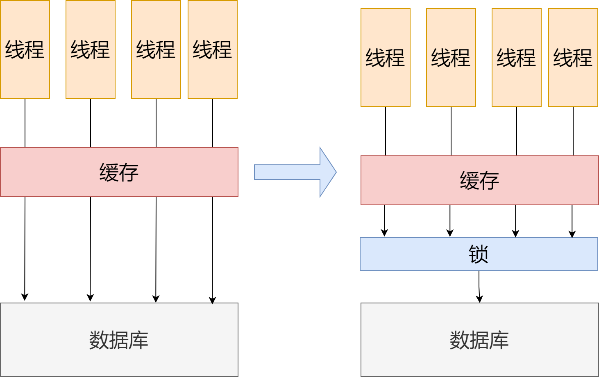

什么是缓存击穿？
顾名思义，就是把缓存打透了，但数据库没透，如果数据库也透了叫做缓存穿透。

好像这是一个很正常的事情。大家都知道，一般缓存层都会设置个数据过期时间。
不然随着查询的越来越多，缓存越来越大，内存撑不住，服务器爆炸。如果数据到期了，那当然，缓存查不到数据，只能从数据库查了。

但如果大家处理的查询请求都是查这个数据呢？

举例来说前阵子爆火的鸿星尔克XX款鞋子。缓存存了商品信息，直播间挤满了想抢货的小伙伴。

到点了，大家抢购开始，假设突然之间，这个缓存的信息到期了，Redis给删了这块信息，于是大量请求就没打到缓存上，直接打到后端数据库上了。

大家注意，根据《Redis in action》提到的，redis的性能是普通关系型数据库的10-100倍，所以如果redis能处理勉勉强强处理的请求，打到MySQL上，MySQL肯定挂了。

所以，这还真是个问题。

那咋解决呢？这很好办，咱们可以从两个思路出发。目前我们可以使用的道具也就是后端数据库，和Redis。那咱们分别从这两个角度出发。

## 方法1：从MySQL角度出发
咱站在MySQL的角度，多心疼一下它。不就是大流量我MySQL处理不了嘛，那我直接把流量想个招，变成原来的1/100-1/10，那MySQL肯定轻轻松松可以处理。

那咋搞呢？加锁。线程读数据，之前100个都可以同时读，现在来个锁，线程读取数据，先看看数据有没有上锁，上锁了，等着，没上锁，获取锁后，再给数据库请求。
数据库压力肯定瞬间下来了。

但有的读者肯定会问：这样子，用户体验是不是就会卡顿。这是必然的，牺牲用户体验，保证数据库不死机，这就是这个方式的设计出发点。

## 方法2：从Redis角度出发
咱站在Redis角度想想。为啥出现目前问题，还不是因为Redis缓存数据过期没了。
那如果对Redis动刀，怎么解决？那肯定是修改Redis缓存的数据过期策略了。
最常见的，也是大家八股文背的最多的，就是设置热点数据永不过期。

但这个方法，咋说呢，简单粗暴，很多情况下，我们无法预知热点数据。比如换做半年前，鸿星尔克出圈前，电商平台设计者在初始化redis数据库的时候，也不可能直接把它归为热点数据。

那咋搞呢？还是从数据过期策略出发，咱可以搞个这样的逻辑嘛。

如果发现这个数据快过期，并且好像最近这个数据访问特别多，后台新启一个异步线程，重新在缓存层中添加这个数据的缓存，给这个数据再续一续命。

