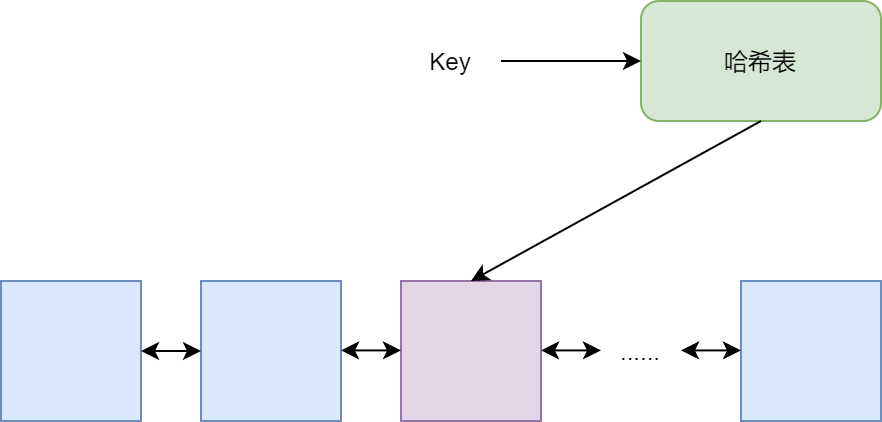

##

常用的缓存策略有这么几种：
先进先出first in first out（FIFO), 最近最少使用Least Recently Used(LRU)，和最不经常使用Least Frequently Used（LFU）

## 先进先出FIFO
FIFO相信大家并不陌生，采用这种方法进行缓存淘汰的理由也很简单，就是越晚进入内存的数据，越容易被访问（有点类似时间局部性原理的味了）。所以，要是内存不够了需要淘汰数据，从最早进入内存的数据开始淘汰。

FIFO实现的方式更为简单了，直接上一个队列，就OK了。

## 最近最少使用LRU
要是说FIFO，是带了点时间局部性原理的感觉，LRU，可以说就是基于时间局部性原理设计的算法。
该算法就是记录每个缓存最近访问的时间，当内存大小不够了，需要淘汰数据，那就从最近未被访问时间最长的数据开始淘汰。

LRU实现方法，这里给出一种，就是采用双向链表+哈希表的形式存储。

双向链表用于组织数据，数据采用链表节点进行组织，最经常访问的排在前面，哈希表用于存储键key和值链表节点。

当某个key被访问到了，程序通过哈希表迅速定位节点，并将该节点调整至链表的最开始位置。

## 最不经常使用LFU
