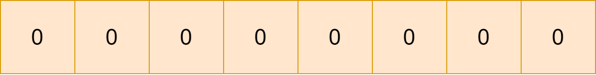
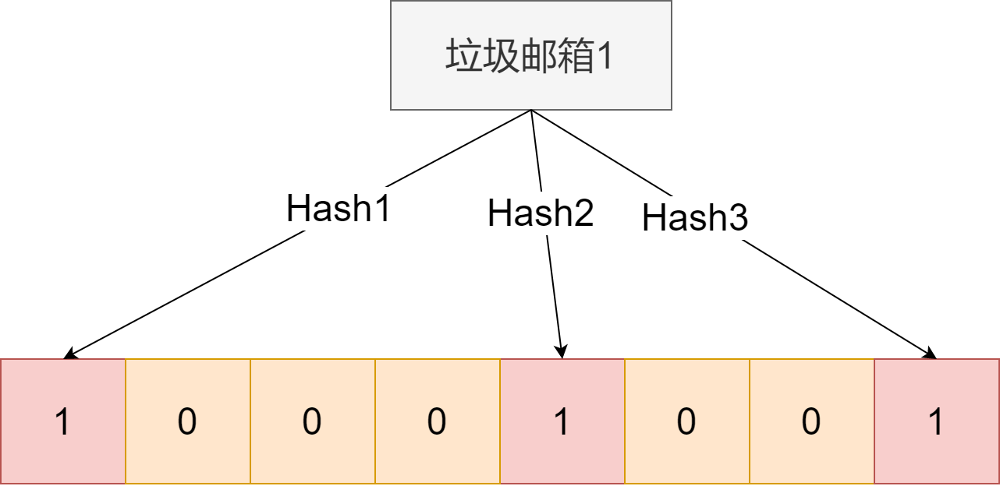
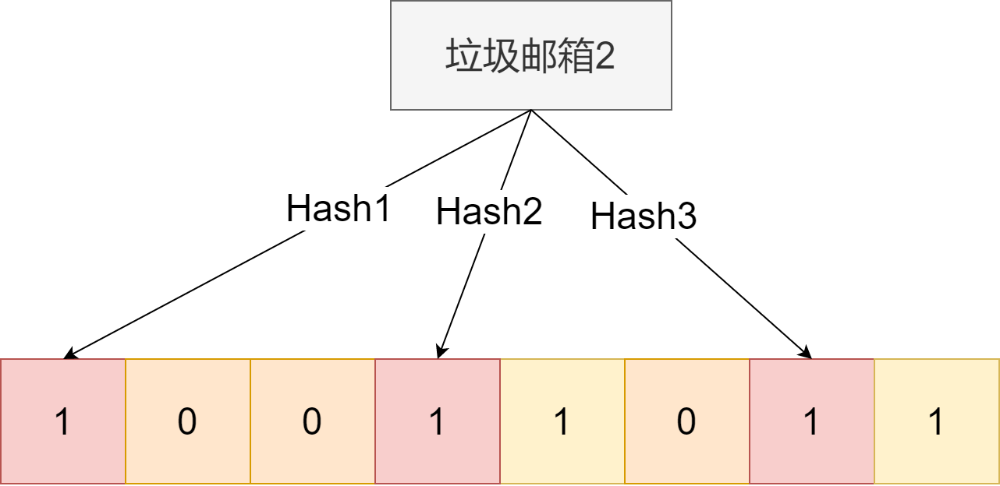

由于redis是内存型数据库，往往会被当做缓存使用，那所以问到redis相关知识点，缓存这层是绕不开的。今天咱来唠唠缓存穿透。

先来看看缓存穿透的定义：
缓存穿透，注意，关键在透这个词上，就是不仅把缓存层打透了，也把数据库打透了，即查询一个数据库也不存在的数据。

由于数据库不存在这个值，那肯定缓存也不会有嘛，所以每次有这种垃圾查询请求，都会打到数据库上，对数据库造成负担。

那咋办呢？

今天介绍两个办法
1. 布隆过滤器
2. 缓存空对象

## 布隆过滤器
相信不少同学面试时被问过场景设计题：
如果目前我们有个营销垃圾邮箱的汇总表，我们希望设计一个高效的拦截过滤器，怎么设计呢？

大家肯定脱口而出：hashmap/hashset。

对，这个思路一点没错，如果我们的邮箱汇总表不大，当然可以这么干。但如果汇总表稍微大一点点比如上到10亿，那就不能这么干了。
一般来说面试官会回答：这么做占用空间太大，服务器内存撑不住，可以换一个思路，我们的这个业务可以允许一定的误报。

既然面试官都给提示了，那咱就往挤压内存占用的思路去考虑，既然又希望减少空间，又能接受误报，可以考虑这个思路。

首先我们先设置一个空bit数组，初始全0：

设计k个hash映射函数，这k个映射函数各不相同，然后开启一个for循环，把在汇总表中的邮箱通过这个映射函数得到数组指定位置，并置为1。
比如这样：

然后这样

下次用户有想查询的邮箱，可以通过这一系列hash函数，判断对应位置是否全为1。如果是，则很大概率就是垃圾邮箱了。
为啥说是很大概率，因为完全不同的字段，在一个hash函数中，映射也会相同的。

那如何减少误判概率？增加hash函数个数，增加这个数组长度。

最后提一下，这个数组可以就认为是布隆过滤器。

## 缓存空对象
这个就很好理解了。咱们一般定义的查询逻辑，是这样
1. 用户发送查询请求
2. 缓存层收到请求查看缓存是否存在该值，存在即返回，不存在走步骤3
3. 数据库收到查询请求，查询该值，如果存在，就返回，并把值添加到缓存层上。不存在直接返回

举例来说，我们用了个员工id和其对应的工资表。如果员工有100个人，那我们id肯定是1-100排列。如果此时有个请求，想查询id=1000的，那肯定啥也查不到，会被直接返回。

而缓存空对象，做的就是把这个值也缓存下来，即在缓存层中，添加一个id为1000，值为null的键值对。下次有对id为1000的请求，查询直接打到缓存上，减少了数据库压力。

但这种操作会增加内存开销，所以如果采用这种方法，一般空对象缓存的过期时间极短。

参考：
1. https://blog.csdn.net/qq_26222859/article/details/80831263
2. https://zhuanlan.zhihu.com/p/72378274